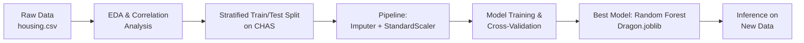

<h1 align="center">🏠 Dragon Real Estate — House Price Predictor</h1>

<p align="center">
  A machine learning regression project that predicts median home values in Boston using the classic Boston Housing dataset — from EDA and feature engineering to model selection and deployment-ready inference.
</p>

<p align="center">
  
  
  
  
  
  
</p>

<p align="center">
  <a href="#-overview">Overview</a> •
  <a href="#-tools--technologies">Tools</a> •
  <a href="#-dataset">Dataset</a> •
  <a href="#%EF%B8%8F-ml-pipeline">ML Pipeline</a> •
  <a href="#-key-insights--charts">Insights & Charts</a> •
  <a href="#-model-performance">Model Performance</a> •
  <a href="#-project-structure">Structure</a> •
  <a href="#-how-to-use">How to Use</a> •
  <a href="#-contact">Contact</a>
</p>

---

## 📌 Overview

**Dragon Real Estate** is an end-to-end supervised machine learning project that predicts the **median value of owner-occupied homes** (in $1000s) using 13 socio-economic and structural features of Boston-area neighborhoods. The project covers **exploratory data analysis, missing-value imputation, feature scaling, stratified train/test splitting, model comparison, and cross-validation**, and ships a trained model (`Dragon.joblib`) ready for inference.



---

## 🛠 Tools & Technologies

| Category | Tools Used |
|---|---|
| **Language** | Python |
| **Data Handling** | Pandas, NumPy |
| **Visualization** | Matplotlib, Seaborn |
| **Machine Learning** | Scikit-learn (Pipeline, SimpleImputer, StandardScaler, RandomForestRegressor, DecisionTreeRegressor, LinearRegression) |
| **Model Persistence** | Joblib |
| **Development** | Jupyter Notebook |

---

## 📂 Dataset

This project uses the classic **Boston Housing Dataset** (506 instances, 13 features), originally from the UCI Machine Learning Repository.

| Feature | Description |
|---|---|
| `CRIM` | Per-capita crime rate by town |
| `ZN` | Proportion of residential land zoned for large lots |
| `INDUS` | Proportion of non-retail business acres per town |
| `CHAS` | Charles River dummy variable (1 if tract bounds river) |
| `NOX` | Nitric oxide concentration |
| `RM` | Average number of rooms per dwelling |
| `AGE` | Proportion of owner-occupied units built before 1940 |
| `DIS` | Weighted distance to employment centers |
| `RAD` | Index of accessibility to radial highways |
| `TAX` | Property tax rate per $10,000 |
| `PTRATIO` | Pupil-teacher ratio by town |
| `B` | Proportion related to Black population by town |
| `LSTAT` | % lower-status population |
| **`MEDV`** | **Target** — Median home value ($1000s) |

---

## ⚙️ ML Pipeline

1. **Exploratory Data Analysis** — distributions, `.describe()`, correlation matrix
2. **Stratified Sampling** — `StratifiedShuffleSplit` on `CHAS` to preserve class balance in train/test sets
3. **Missing Value Handling** — `SimpleImputer(strategy="median")` for the `RM` column
4. **Feature Scaling** — `StandardScaler` inside a `sklearn.Pipeline`
5. **Model Training & Comparison** — Linear Regression, Decision Tree, Random Forest evaluated via **10-fold cross-validation**
6. **Model Selection & Export** — Best model (Random Forest) saved as `Dragon.joblib`
7. **Inference** — Reload the model and predict on new/unseen feature vectors

---

## 📊 Key Insights & Charts

- 🛏️ **`RM` (rooms per dwelling)** has the **strongest positive correlation** with home value — more rooms, higher price
- 📉 **`LSTAT` (% lower-status population)** has the **strongest negative correlation** — a key driver of lower home values
- 🌳 **Random Forest Regression outperformed** Linear Regression and Decision Tree, achieving the **lowest cross-validation RMSE**

<table>
<tr>
<td width="50%">


</td>
<td width="50%">


</td>
</tr>
<tr>
<td width="50%">


</td>
<td width="50%">


</td>
</tr>
</table>

> 📌 Charts are generated directly from `housing.csv` and the cross-validation results in `outputs from different models.txt`.

---

## 🏆 Model Performance

10-fold cross-validation RMSE (lower is better):

| Model | Mean RMSE | Std. Deviation |
|---|---|---|
| Linear Regression | 4.28 | 0.80 |
| Decision Tree | 4.16 | 0.82 |
| **Random Forest (Best)** | **3.39** | **0.75** |

The **Random Forest Regressor** was selected as the final model and exported to `Dragon.joblib` for reuse.

---

## 📂 Project Structure

```
Dragon-Real-Estate-Price-Prediction/
│
├── data/
│   ├── housing.csv                          # Boston housing dataset
│   └── Boston house prices dataset.txt      # Dataset description
│
├── notebooks/
│   ├── Dragon Real Estates.ipynb            # Main EDA + training notebook
│   ├── Model Usage.ipynb                    # Model inference notebook
│   └── Model Usage1.ipynb                   # Alternate inference notebook
│
├── src/
│   ├── Dragon Real Estates.py               # Script version of main notebook
│   └── Model Usage1.py                      # Script version of inference notebook
│
├── images/                                  # Generated charts & graphs
│   ├── feature_correlation.png
│   ├── model_comparison.png
│   ├── rm_vs_medv.png
│   └── lstat_vs_medv.png
│
├── models/
│   └── Dragon.joblib                        # Trained Random Forest model
│
├── outputs from different models.txt        # Cross-validation results
└── README.md                                # Project documentation
```

---

## 🚀 How to Use

1. **Clone the repository**
   ```bash
   git clone https://github.com/pranjalpandey298/Dragon-Real-Estate-Price-Prediction.git
   cd Dragon-Real-Estate-Price-Prediction
   ```

2. **Install dependencies**
   ```bash
   pip install pandas numpy scikit-learn matplotlib seaborn joblib
   ```

3. **Train from scratch** (optional)
   Run `Dragon Real Estates.ipynb` (or the `.py` equivalent) to reproduce EDA, training, and model export.

4. **Run inference with the trained model**
   ```python
   from joblib import load
   import numpy as np

   model = load('Dragon.joblib')
   features = np.array([[-0.43, 3.12, -1.12, -0.27, -1.42, 
                          -0.24, -1.31, 2.61, -1.06, -0.57, 
                          -1.09, 0.44, -0.86]])  # example scaled feature vector
   prediction = model.predict(features)
   print(prediction)
   ```

---

## 📬 Contact

**Pranjal Pandey**
🔗 GitHub: [@pranjalpandey298](https://github.com/pranjalpandey298)

If you have questions or suggestions, feel free to open an issue or connect on GitHub!

⭐ If you found this project useful, consider giving it a **star**!
